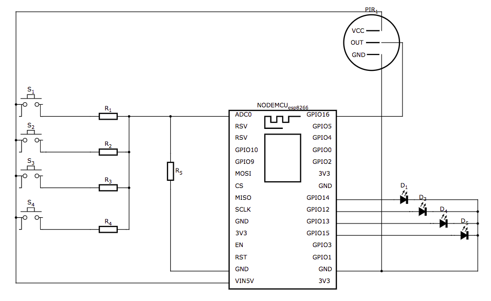

## MoodBox

Thanks to Moodbox, you can measure the happiness of your employees.

## Components

### Moodbox

#### Parts

- [ESP8266 NodeMcu](https://www.aliexpress.com/item/V3-Wireless-module-NodeMcu-4M-bytes-Lua-WIFI-Internet-of-Things-development-board-based-ESP8266-esp/32647542733.html)
- [HC-SR04](https://www.aliexpress.com/item/Ultrasonic-Module-HC-SR04-Distance-Measuring-Transducer-Sensor-for-Arduino/32477198302.html)
- [4x 60mm Acarde LED Push Button](https://www.aliexpress.com/item/Hot-5-Colors-LED-Light-Lamp-60MM-Big-Round-Arcade-Video-Game-Player-Push-Button-Switch/32799868293.html)
- Resistor (R1 470 Ω, R2 1 kΩ, R3 2.2 kΩ, R4 4.7 kΩ)

#### Circuit

### Moodbox Backend

## How does it work?

